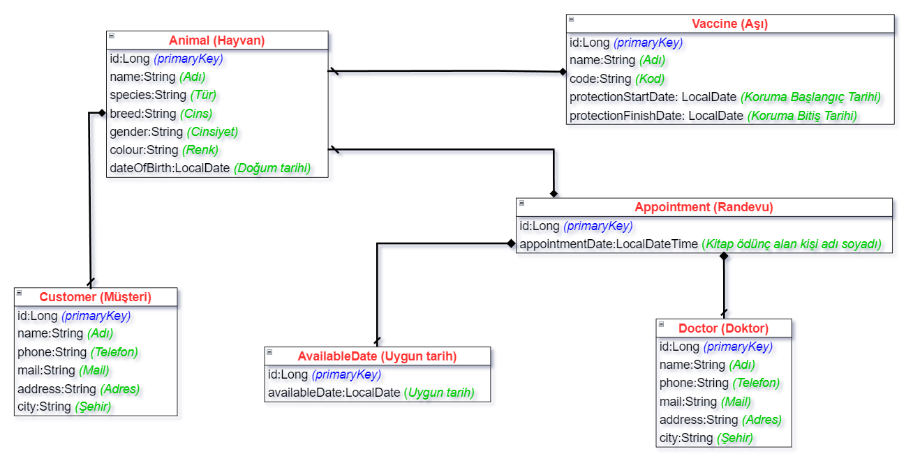
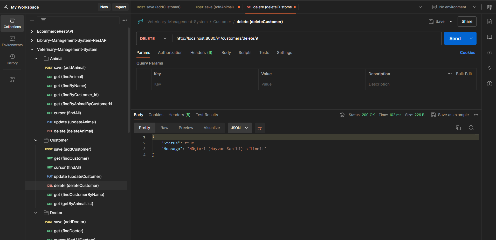
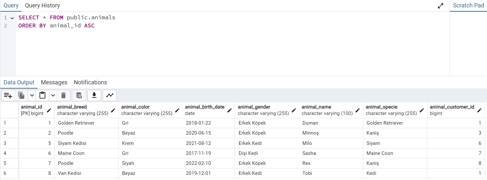
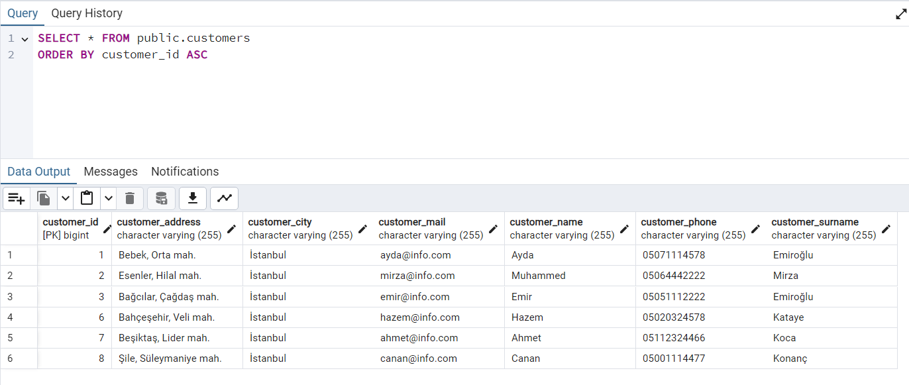
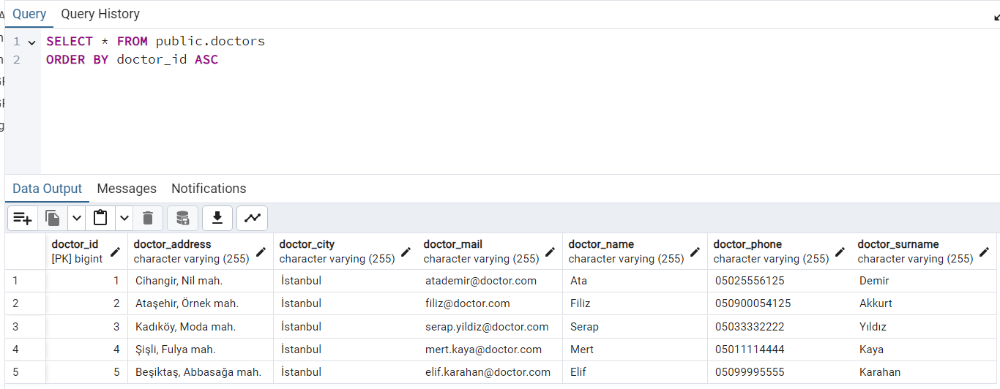
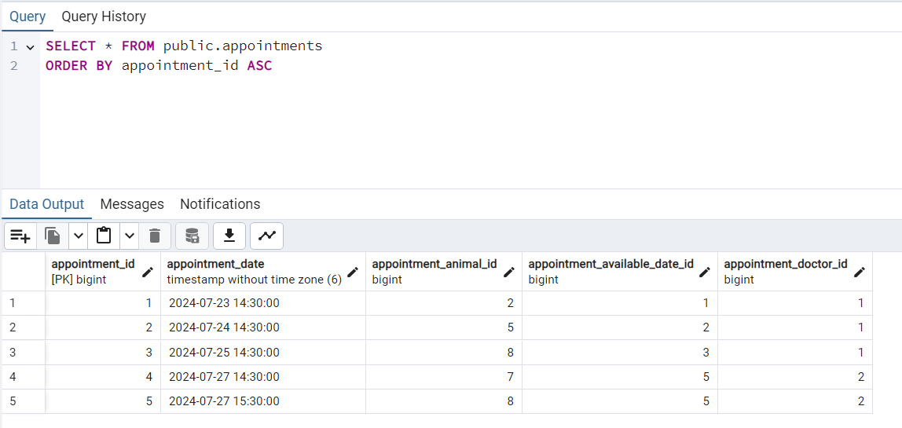
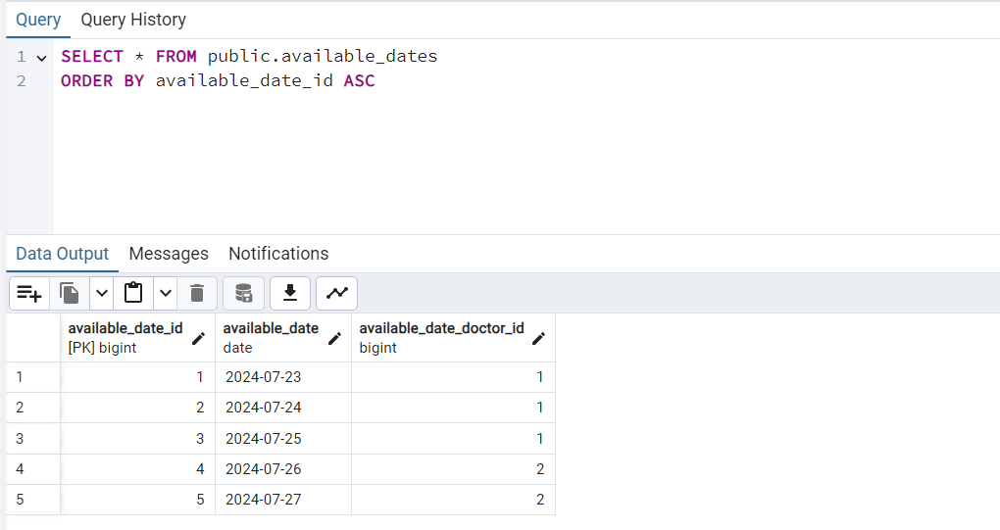
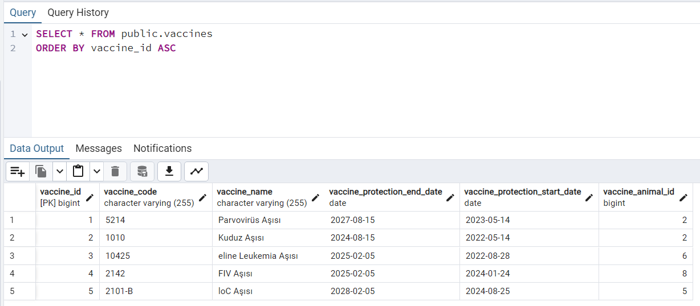

<h1 align="center">Veteriner Yönetim Sistemi</h1>
<h3 align="center">Bu proje, bir veteriner kliniğinin kendi işlerini yönetebildiği bir API geliştirmeyi amaçlamaktadır. Bu uygulama, veteriner çalışanları tarafından kullanılmak üzere tasarlanmıştır ve aşağıdaki özellikleri içermektedir:

</h3>  

<br/>

<p align="center"> 
  
</p>

<!-- TABLE OF CONTENTS -->
<h2 id="table-of-contents"> :book: İçerik</h2>

<details open="open">
  <summary>İçerik</summary>
  <ol>
    <li><a href="#proje-ozeti"> ➤ Proje Özeti</a></li>
    <li><a href="#teknolojiler"> ➤ Kullanılan Teknolojiler</a></li>
    <li><a href="#kurulum"> ➤ Kurulum ve Başlatma</a></li>
    <li><a href="#hayvan-yonetimi"> ➤ Hayvanların ve Sahiplerinin (customer) Yönetimi</a></li>
    <li><a href="#ası-yonetimi"> ➤ Uygulanan Aşıların Yönetimi</a></li>
    <li><a href="#randevu-yonetimi"> ➤ Randevu Yönetimi</a></li>
    <li><a href="#veteriner-doktor-yonetimi"> ➤ Veteriner Doktor Yönetimi</a></li>
     <li><a href="#musait-gun-yonetimi"> ➤ Doktorların Müsait Günlerinin Yönetimi</a></li>
    <li><a href="#sistem-gorselleri"> ➤ Program İçi Görseller</a></li>
    <li><a href="#iletisim"> ➤ İletişim</a></li>
  </ol>
</details>


<!-- VİDEO -->
<h2 id="proje-ozeti-video-kaydı"> :video_camera: Proje Özeti Video Kaydı</h2>

<p>
✤ <a href="https://www.youtube.com/channel/UCEJ2dE8VjikdFug6d26wDBA">Video Linki</a> <br>
</p>


<!-- VİDEO -->
<h2 id="proje-ozeti-video-kaydı"> :book: Proje de yer alan API End-Pointlerini anlatım dökümanı için aşağıdaki linke tıklayınız:</h2>

<p>
✤ <a href="https://drive.google.com/file/d/1p_tFcJIKv-flfz7vTUN5IN-o-4HXMx4y/view">Döküman Linki</a> <br>
</p>


<!-- PROJECT OVERVIEW -->
<h2 id="proje-ozeti"> :mag_right: Proje Özellikleri</h2>

<p align="justify"> 
Özellikler:
</p>

~~~~~~

- Veteriner Doktorları Kaydetme
- Doktorların Çalışma Günlerini Kaydetme
- Müşterileri Kaydetme
- Müşterilere Ait Hayvanları Kaydetme
- Hayvanlara Uygulanan Aşıları Kaydetme
- Hayvanlar İçin Veteriner Hekimlere Randevu Oluşturma
- Randevuların Yönetimi

~~~~~~

## Entity Sınıfları

### Animal

~~~~~~
- id: Long
- name: String
- species: String
- breed: String
- gender: String
- colour: String
- dateOfBirth: LocalDate
~~~~~~

### Customer
~~~~~~
- id: Long
- name: String
- phone: String
- mail: String
- address: String
- city: String
~~~~~~

### Vaccine
~~~~~~
- id: Long
- name: String
- code: String
- protectionStartDate: LocalDate
- protectionFinishDate: LocalDate
~~~~~~

### Doctor
~~~~~~
- id: Long
- name: String
- phone: String
- mail: String
- address: String
- city: String
~~~~~~

### AvailableDate
~~~~~~
- id: Long
- availableDate: LocalDate
~~~~~~

### Appointment
~~~~~~
- id: Long
- appointmentDate: LocalDateTime
~~~~~~

## API Temel Özellikleri

### Hayvanların ve Sahiplerinin Yönetimi

~~~~~~
- Hayvanları kaydetme, bilgilerini güncelleme, görüntüleme ve silme
- Hayvan sahiplerini kaydetme, bilgilerini güncelleme, görüntüleme ve silme
- Hayvan sahiplerini isme göre filtreleme
- Hayvanları isme göre filtreleme
- Hayvan sahibine göre hayvanları listeleme
~~~~~~

### Uygulanan Aşıların Yönetimi

~~~~~~
- Hayvanlara uygulanan aşıları kaydetme, bilgilerini güncelleme, görüntüleme ve silme
- Aynı tip aşının koruyuculuk süresi dolmamışsa yeni aşı kaydedememe
- Hayvan id’sine göre aşı kayıtlarını listeleme
- Aşı koruyuculuk bitiş tarihi belirli aralıkta olan hayvanları listeleme
~~~~~~

### Randevu Yönetimi
~~~~~~
- Randevuları oluşturma, güncelleme, görüntüleme ve silme
- Randevuları tarih ve saat içerecek şekilde kaydetme
- Doktorların müsait günlerinde ve saatlerinde randevu oluşturma
- Randevuları tarih aralığına ve doktora göre filtreleme
- Randevuları tarih aralığına ve hayvana göre filtreleme
~~~~~~

### Veteriner Doktor Yönetimi
~~~~~~
- Veteriner doktorları kaydetme, bilgilerini güncelleme, görüntüleme ve silme
~~~~~~

### Doktorların Müsait Günlerinin Yönetimi
~~~~~~
- Doktorların müsait günlerini ekleme, bilgilerini güncelleme, görüntüleme ve silme
~~~~~~


<!-- USED TECHNOLOGIES -->
<h2 id="teknolojiler"> :computer: Kullanılan Teknolojiler</h2>

<p align="justify"> 
Projede kullanılan teknolojiler:

[](https://www.java.com/tr/) <br>
[](https://start.spring.io/) <br>
[](https://start.spring.io/) <br>
[](https://start.spring.io/) <br>
[](https://www.java.com/tr/) <br>
[](https://www.java.com/tr/) <br>
[](https://www.java.com/tr/) <br>
[](https://www.postman.com/) <br>
[](https://www.postgresql.org/) <br>
[](https://www.python.org/) <br>

</p>


<!-- SETUP AND LAUNCH -->
<h2 id="kurulum"> :hammer: Kurulum ve Başlatma</h2>

<p align="justify"> 
Projeyi  klonlamak ve çalıştırmak için aşağıdaki adımları takip edin:

```bash
git clone https://github.com/behcetmuhammed/Veterinary-Management-System-RestAPI.git
cd Veterinary-Management-System-RestAPI
```
Projeyi IDE'nizde açın ve `VmsApplication` sınıfını çalıştırın.
</p>

<h3 id="kurulum"> :warning: Uyarı: Bu proje, `JDK 18 Amazon Corretto 18.0.2` ile uyumludur. Lütfen bu JDK sürümünü kullanarak projeyi çalıştırın. Ayırca language level seçeneğini `17-Sealed types, always-strict floating-point semantics` olarak ayarlayın</h3>


<!-- USER MANAGEMENT -->
<h2 id="hayvan-yonetimi"> :busts_in_silhouette: Hayvanların ve Sahiplerinin (customer) Yönetimi</h2>

* Hayvanları kaydetme, bilgilerini güncelleme, görüntüleme ve silme işlemleri tamamlandı.
* Hayvan sahiplerini kaydetme, bilgilerini güncelleme, görüntüleme ve silme işlemleri tamamlandı.
* Hayvan sahipleri isme göre filtrelenecek şekilde API endpoint oluşturuldu.
* Hayvanlar isme göre filtrelenecek şekilde API endpoint oluşturuldu.
* Hayvan sahibinin sistemde kayıtlı tüm hayvanlarını görüntülemek için API endpoint oluşturuldu. Hayvan sahibine göre hayvanlara filtreleme yapılabilir.


<!-- HOTEL MANAGEMENT -->
<h2 id="ası-yonetimi"> :hotel: Uygulanan Aşıların Yönetimi</h2>

* Hayvanlara uygulanan aşıları kaydetme, bilgilerini güncelleme, görüntüleme ve silme işlemleri tamamlandı.
* Eğer hastaya ait aynı tip aşının (adı ve kodu aynı olan aşı) aşı koruyuculuk bitiş tarihi daha gelmemiş ise sisteme yeni aşı girilememesi sağlandı. Aşı kodlarından ve aşı bitiş tarihlerinden bu kontrol yapıldı.
* Hayvan id’sine göre belirli bir hayvana ait tüm aşı kayıtlarını listelemek için gerekli API endpoint oluşturuldu.
* Kullanıcının aşı koruyuculuk bitiş tarihi yaklaşan hayvanları listeleyebilmesi için gireceği başlangıç ve bitiş tarihlerine göre aşı koruyuculuk bitiş tarihi bu aralıkta olan aşıları hayvan bilgileriyle birlikte listesini geri döndüren API endpoint oluşturuldu.


<!-- ROOM MANAGEMENT -->
<h2 id="randevu-yonetimi"> :door: Randevu Yönetimi</h2>

* Hayvanların aşı ve muayene randevularının oluşturulması, bilgilerinin güncellenmesi, görüntülenmesi ve silinmesi işlemleri tamamlandı.
* Randevular sisteme tarih ve saat içerecek şekilde kaydedilmekte olup, LocalDateTime kullanılmaktadır.
* Hayvanların her türlü muayenesi için doktorlardan uygun tarihlerde ve saatlerde randevu oluşturulmakta; her doktor için sadece saat başı randevu oluşturulabilmektedir. Bir muayenenin sabit olarak bir saat süreceği kabul edilmiştir.
* Randevu kaydı oluşturulurken doktorun girilen tarihte müsait olup olmadığı ve girilen saatte başka bir randevusu olup olmadığı kontrol edilmekte; her iki durum şartı sağlanırsa randevu oluşturulmakta, şart sağlanmazsa "Doktor bu tarihte çalışmamaktadır! /Girilen saatte başka bir randevu mevcuttur." gibi hata mesajı fırlatılmaktadır. Custom exception oluşturulmuştur.
* Randevular kullanıcı tarafından girilen tarih aralığına ve doktora göre filtrelenebilmekte; buna ait API endpoint oluşturulmuştur. (Randevu için kliniği arayan müşterilerin doktor ve gün taleplerinde uygunluk olup olmadığını sorgulamak için kullanılacaktır.) Jpa’nın findBy between kullanımı sağlanmıştır.
* Randevular kullanıcı tarafından girilen tarih aralığına ve hayvana göre filtrelenebilmekte; buna ait API endpoint oluşturulmuştur. Jpa’nın findBy between kullanımı sağlanmıştır.


<!-- RESERVATION OPERATIONS -->
<h2 id="veteriner-doktor-yonetimi"> :clipboard: Veteriner Doktor Yönetimi</h2>

* Veteriner doktorların kaydedilmesi, bilgilerinin güncellenmesi, görüntülenmesi ve silinmesi işlemi yapıldı.


<!-- RESERVATION OPERATIONS -->
<h2 id="musait-gun-yonetimi"> :clipboard: Doktorların Müsait Günlerinin Yönetimi</h2>

* Doktorların müsait günlerini ekleme, bilgilerini güncelleme, görüntüleme ve silme işlemleri tamamlandı.
* Doktorun çalıştığı günler sisteme LocalDate olarak kaydedilmekte; sadece tarih bilgisi bulunmaktadır. Saat, dakika, saniye bilgisi yer almamaktadır.


<!-- PROGRAM SCREENSHOTS -->
<h2 id="sistem-gorselleri"> :camera: Program İçi Görseller</h2>

<p align="justify"> 

### Postman Genel Gösterim



### Animals Tablosu



### Customer Tablosu



### Doctors Tablosu



### Appointments Tablosu



### Available-Dates Tablosu



### Vaccines Tablosu




<!-- CONTACT -->
<h2 id="iletisim"> :phone: İletişim ve Bilgiler</h2>

<p>
✤ <a href="https://www.linkedin.com/in/emir-muhammed/">LinkedIn</a> <br>
✤ <a href="https://github.com/behcetmuhammed">GitHub</a> <br>
</p>
